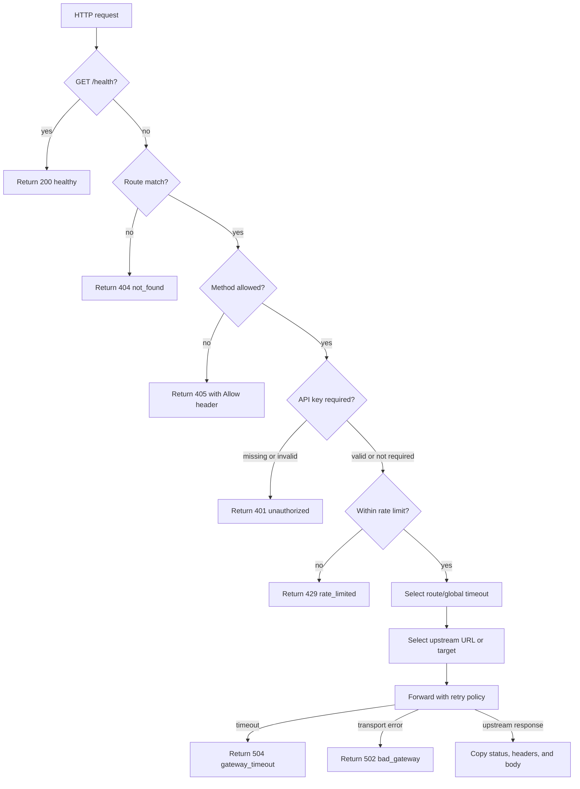
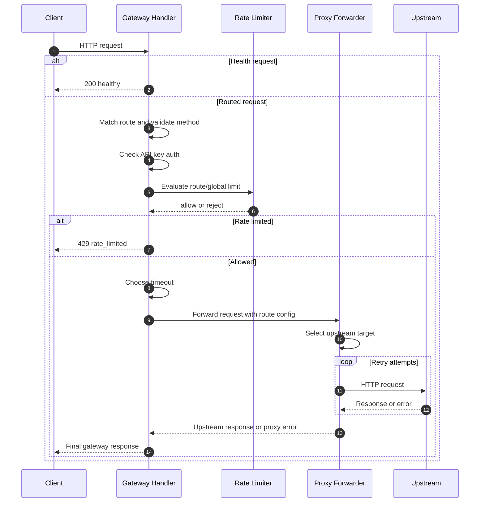

# GatewayKit Decisions

This document explains how I prioritized the implementation, how the gateway is structured,
what trade-offs I made, and what I would build next.

## Prioritization

I started with the non-negotiable baseline requirements:

1. Load configuration from a YAML file.
2. Start an HTTP server on the configured port.
3. Serve `GET /health` independently of route configuration.
4. Match configured routes and enforce allowed methods.
5. Proxy requests to upstream services.
6. Prove the behavior with a self-contained test suite.

After that baseline was solid, I prioritized features that demonstrate production gateway
thinking while staying testable in a short time box:

1. Prefix stripping and timeouts, because they affect the core proxy path.
2. API key auth, because it is a small but important request-gating middleware.
3. Rate limiting, because it exercises concurrency and shared in-memory state.
4. Retries, because they add resilience and force careful request-body handling.
5. Multiple upstream targets, because they demonstrate extensible upstream selection.
6. Sliding-window rate limiting, as a stretch goal once fixed-window support was stable.

I deferred request/response transformation, health checks, and circuit breakers because each
deserves careful behavior design and would have expanded the surface area substantially.

## Architecture

The gateway is structured as a small request pipeline:

The runtime request flow looks like this:

The code is split along that pipeline:

- `internal/config` owns YAML parsing and validation.
- `internal/gateway` owns route matching, health, auth, rate limiting, and middleware order.
- `internal/proxy` owns upstream selection, path rewriting, retry behavior, and HTTP forwarding.
- `cmd/mockupstream` provides a small manual test harness.

This keeps route-level policy decisions separate from upstream transport mechanics. Adding a
new middleware should mostly affect `internal/gateway`; adding new upstream behavior should
mostly affect `internal/proxy`.

## Trade-offs

- **In-memory state:** Rate limit buckets and upstream selection counters are in memory. This is
  appropriate for the prompt because no distributed coordination or persistence is required.
  In production, these would need cross-instance coordination or sticky routing.
- **Exact sliding window:** Sliding-window rate limiting uses timestamp queues. This is easy to
  reason about and test, but it can use more memory than an approximate rolling counter under
  high cardinality.
- **Retry body buffering:** The proxy buffers request bodies once so retries can resend the
  original payload. This is correct for the take-home, but production systems would enforce
  request-size limits and consider streaming behavior.
- **Target health:** Round-robin and weighted round-robin do not yet skip unhealthy targets.
  Active health checks are parsed from config but not implemented.
- **Transformations:** Request and response transformation config is parsed but not applied.
  I deferred it because body mapping semantics can get subtle, especially for non-JSON payloads.
- **Circuit breaker:** Circuit breaker config is parsed and validated, but breaker state,
  failure windows, and cooldown behavior are deferred.

## Implemented

- Config loading and validation for the provided schema
- Health endpoint with uptime
- Route matching and method filtering
- Basic reverse proxying
- Prefix stripping
- Global and route-level timeouts
- API key authentication
- Fixed-window rate limiting
- Sliding-window rate limiting
- Per-IP and global rate-limit buckets
- Retry support for configured upstream statuses
- Fixed and exponential retry backoff
- Round-robin upstream selection
- Weighted round-robin upstream selection
- Mock upstream server for local testing

## Partially Implemented Or Deferred

- `request_transform`: parsed but not applied
- `response_transform`: parsed but not applied
- `health_check`: parsed but not actively used to mark targets healthy/unhealthy
- `circuit_breaker`: parsed but not enforced

## What I Would Build Next

1. Active health checks for target upstreams, including unhealthy thresholds.
2. Circuit breaker state with failure windows and cooldown responses.
3. Request and response transformations for JSON payloads and headers.
4. Request-size limits around retry buffering.
5. Containerize the gateway with a small runtime image, documented config mounting, and a
   compose-based local demo that runs the gateway alongside mock upstreams.

## AI Tooling

I used AI assistance to work in small, reviewable stages, keeping each commit focused on one
behavioral milestone. The commit history is intentionally structured to show the order of
implementation and the trade-offs made along the way.
